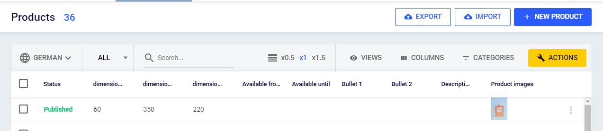

# Product List

Most tasks related with product editing, import and export start at the product list page.

## Page Toolbar

Element | Description
--- | ---
Number of products | Number of visible products (filter applied)
Export | Opens the product export dialog
Import | Navigates to product import. Use this for manual one time imports. See data sources for automated import jobs.
New product | Create a new product

## List Toolbar

Element | Description
--- | ---
Language | Select data language. Translatable attribute values will respect this setting. Note that it does not affect the general UI language.
Search | Search in products, see below for details.
Row height | Set height of list rows.
Views | Save and restore list views, see below for details.
Columns | Manage which attributes to show in list.
Categories | Filter product list by product category.
Action | Apply actions to multiple products.

## Searching and Filtering Products

### Search Text Box

This textbox is to search for products by their name, sku or gtin. Select in which attributes to search using the dropdown left beside the search input. 

Search field allows you to search for multiple values, e.g. multiple SKUs. To search for multiple values

* Type all values separated by semicolon (";") or
* Copy and paste comma, tab or line separated lists or
* Copy and past columns or rows from Excel documents

### Grid Filters

Move mouse pointer over any column header and click the filter icon. Now define your filter inside of dropdown.

## Product Views

Product views store all list settings so you can easily restore views. This includes

* Visible columns
* List sorting
* List filters
