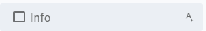
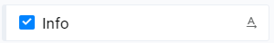
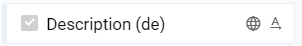
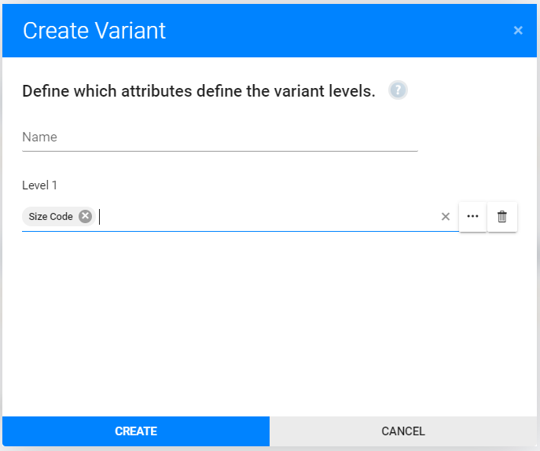
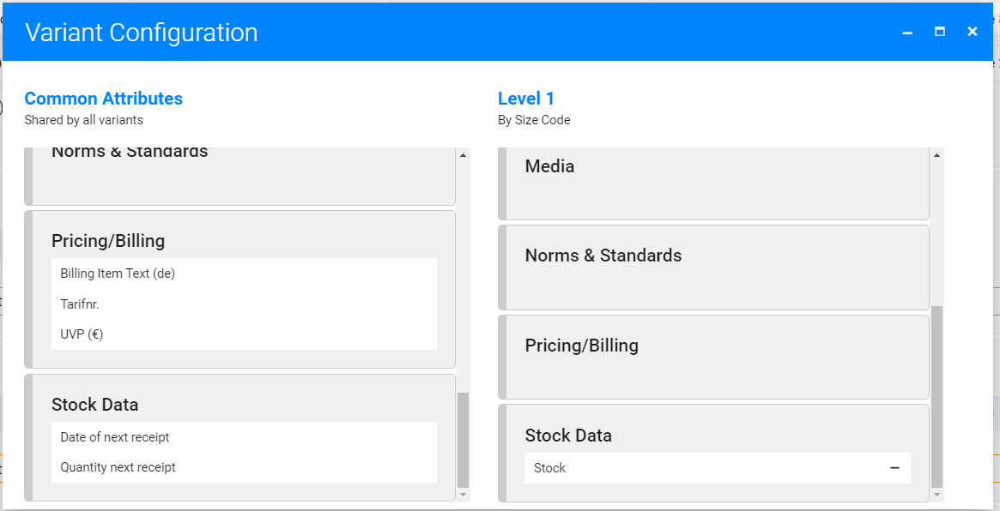

Product types describe what data is stored for one kind of product and how it's organized. This includes

* Which attributes are available
* Are variants available and how should they be organized

# Prerequisites
Before starting to configure product types, ensure all required product attributes are created. See [Attributes & Sections](./attributes.md) for details on how to create and update product attributes.

# Create or Modify Product Types

* Click "Settings" in app header
* Select "Product types" from menu
* Click "Create product type" button
* ... or select an existing product type
* Update and save settings
* Done ;-)

# Product Type Settings
## General
|Form field |Description|
--- | ---
|Name | Name of product type as used inside of app.|

## Attribute Sections
That's where you define which attributes are available for this kind of product.

### Disabled Attributes

Not checked attributes are defined but will not be available.

### Enabled Attributes

Checked attributes are available and will be visible when editing or importing products.

### Common Attributes

This attributes are available because you defined them as "common attributes" which are available for all products. See [Attributes & Sections](./attributes.md) for details.

## Variants
Variants allow you to manage all version of one product together. A typical example are fashion products where you have multiple sizes.

|Product name |Size code |Price|SKU |
--- | --- | --- | ---
|Shirt with logo |S |10 |shirt1-s
|Shirt with logo |M |10 |shirt1-m
|Shirt with logo |L |10 |shirt1-m
|Shirt uni |S |12 |shirt2-s
|Shirt uni |M |12 |shirt2-m
|Shirt uni |L |12 |shirt2-m

We have two products here, and each has three variants (sizes). Without variants we would have six independed products. If we change text or upload product images, we have to do this for each size.

To simplify this, we use variants and tell the system to use the same values for some attributes for all sizes. To do that we need to configue...

* Based on which attribute(s) separate variants must be created. In our example: Attribute "Size code".
* Which attributes are the same for all variants (in our example "Product name" and "Price") and which attributes need a separate value for each ("SKU").

With this setup, our example would result in two products and each of them has three variants.

### Variant Settings
Define which product attribut will "split" the product into variants first:

Then in the next screen drag and drop attributes on the right variant levels:

