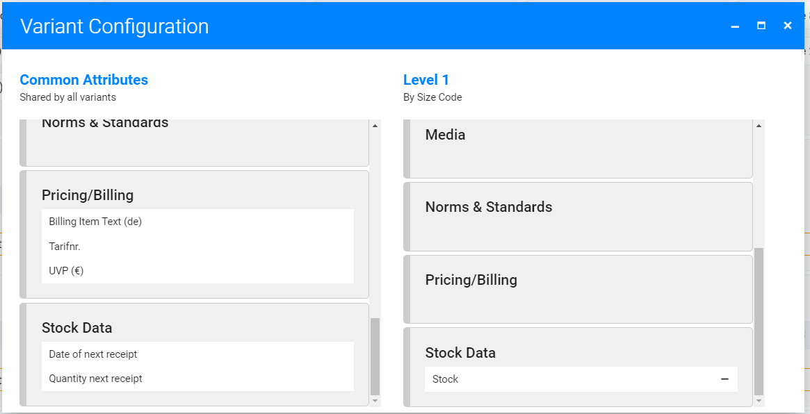

# Product Variants

Variants allow you to manage all versions of one product together. A typical example is fashion products where you have multiple sizes.

|Product name |Size code |Price|SKU |
--- | --- | --- | ---
|Shirt with logo |S |10 |shirt1-s
|Shirt with logo |M |10 |shirt1-m
|Shirt with logo |L |10 |shirt1-m
|Shirt uni |S |12 |shirt2-s
|Shirt uni |M |12 |shirt2-m
|Shirt uni |L |12 |shirt2-m

We have two products here, and each has three variants (sizes). Without variants, we would have six independent products. If we change text or upload product images, we have to do this for each size.

To simplify this, we use variants and tell the system to use the same values for some attributes for all sizes. To do that we need to configure...

* Based on which attribute(s) separate variants must be created. In our example: Attribute "Size code."
* Which attributes are the same for all variants (in our example "Product name" and "Price") and which attributes need a different value for each ("SKU").

With this setup, our example would result in two products and each of them has three variants.

## Prerequisites
You configure variants as part of product types. So you'll need to create a [product type](./product-types.md) first.

## Create or Modify Product Variants

* Click "Settings" in app header
* Select "Product types" from menu
* Click "New product type" button or select an existing product type
* Scroll down to card "Variants"
* Update and save settings

## Variant Settings
### Allow Non-Variant Products
Disable this checkbox if only variant products are allowed.

### Create New Variant Configuration

#### Define Variant Levels
Define which product attribute will "split" the product into variants first and give your variant configuration a name:

Then in the next screen drag and drop attributes on the right variant levels:

Close the screen when done and save the changes in product type.

#### Test It

Navigate to your product list and click "New product". Now you'll see a sidebar that lists all product types. Select the product type and you'll see the list of variant configurations that should include your new variant. Click on it to create the new product and check if the form looks as expected.