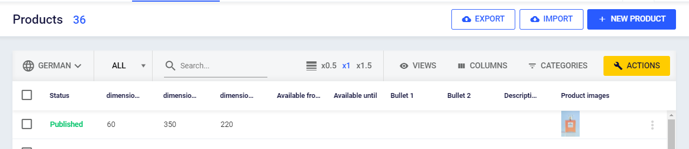

Most tasks related to product editing, import and export start at the product list page.

## Page Toolbar

Element | Description
--- | ---
Number of products | Number of visible products (filter applied)
Export | Opens the product export dialog
Import | Navigates to product import. Use this for manual one-time imports. See data sources for automated import jobs.
New product | Create a new product

## List Toolbar

Element | Description
--- | ---
Language | Select data language. Translatable attribute values will respect this setting. Note that it does not affect the general UI language.
Search | Search in products; see below for details.
Row height | Set the height of the list rows.
Views | Save and restore list views; see below for details.
Columns | Manage which attributes to show in the list.
Categories | Filter product list by category.
Filter | Filter the list by your custom attributes and the product's other fields, whether or not they are shown as columns; see below.
Action | Apply actions to multiple products.

## Searching and filtering products

Three tools narrow the list, and they work together: the search box finds products by a value you type, **Filter** in the toolbar combines conditions on many fields, and the filter in a column header filters on that one column.

### Search text box

This textbox is to search for products by their name, sku or gtin. First, select which attributes to search using the dropdown left beside the search input. 

The search field allows you to search for multiple values, e.g., multiple SKUs. To search for multiple values

* Type all values separated by a semicolon (";") or
* Copy and paste comma, tab or line separated lists or
* Copy and past columns or rows from Excel documents

### Filter

**Filter** in the list toolbar builds a filter from the fields a product has: your own custom attributes, and the fields the platform keeps for every product, such as when it was created, its product type, its categories and its status.

1. Click **Filter**.
2. Choose a field. **Search fields** finds one by name.
3. Choose an operator and enter or pick a value.
4. To add another condition, click **Add condition**. To combine some conditions separately from the rest, click **Add group**.

A group matches when **all** of its conditions match (AND) or when **at least one** does (OR); to switch, click the badge at the top of the group that reads **AND** or **OR**. The list updates as soon as every condition is complete, and the **Filter** button is highlighted while a filter is applied. A filter is part of the list settings a [product view](#product-views) saves.

**A filter reaches a field whether or not its column is shown.** To find products created last week, filter on **Created on**; there is no need to add a column for it first.

The field list is grouped. Besides **Attributes**, which holds your custom attributes, it offers these fields:

| Group | Field | What it filters on |
| --- | --- | --- |
| Identifiers | Variant ID | The ID of one product variant. |
| Identifiers | Product ID | The ID of a product, which matches all its product variants. |
| Dates | Created on | When the product was created. |
| Dates | Last updated | When the product was last changed. |
| Classification | Product type | The product's [product type](/en/concepts/product-types.html), picked from a list. |
| Classification | Categories | One [category](/en/concepts/categories.html), picked from a list. **linked directly to** finds products assigned to that category itself; **linked to, including subcategories** also finds products in any category below it. |
| Classification | Status | **Draft**, **Published**, **Modified** or **Partially published** — the same four values as the filter in the **Status** column header. |
| Product variants | Variant space ID | The product's variant configuration: which attributes split it into product variants, level by level (for example color, then size), picked from a list. Every product uses exactly one of its product type's variant configurations; see [product variants](/en/concepts/product-variants.html). |

A **Variant ID** or **Product ID** is entered in full, in the form `3f2b91c4-7a10-4d8e-9c55-0b1e6a2d8f77`.

Prices and delivery windows cannot be filtered on.

### Column header filters

Move the mouse pointer over any column header and click the filter icon. Now define your filter inside of the dropdown. A column header filter applies to that one column; to combine conditions, or to filter on a field that is not shown as a column, use **Filter** instead.

## Product Views

Product views store all list settings so you can quickly restore views. This includes

* Visible columns
* List sorting
* List filters
